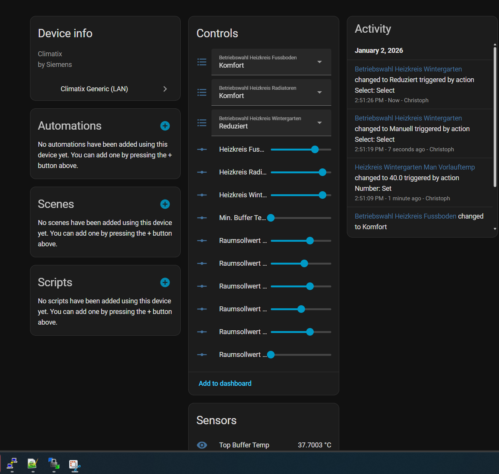

# Ochsner Heat Pump → local control → Home Assistant

**What the hell is this repo?**

It's a way to locally read and control Heatpump settings! All without Modbus or Cloud services required!

**How does it work?**

Instead of interacting with the Heatpump over the Interface that is offered via ModbusTCP which is very undocumented and allows you to only read some values and control almost nothing, this one uses the JSON Interface that the OTS App itself uses to communicate with the heatpump (which is even less documented since it is entirely reverse engineered), except it runs entirely locally!

The app uses the Siemens ClimatixIC cloud to send these json requests over to the heatpump, but the App on the display of the Heatpump itself (which is the exact same app by the way) uses the local web interface from siemens on the heatpump to locally read or write values all without any cloud required. This Home Assistant Integration allows you to link a heatpump to automatically read and write all the same values as you would in the app. 

The only caveat here is that these values may be different for every single heat pump, and they have numeric names that may or may not be auto generated, so the only way to identify the ids of the values you want to access is to first download the heatpump configuration from the Ochsner cloud using your ochsner credentials.

The repo contains a script that allows you to use your ochsner account to download the entire heatpump config as a json, and then use various commands to scan through the json file in order to find the ids for all the settings you want to add into home assistant. Finally, there is the custom integration which you can use to add all these values into home assistant.

I've only tested this with an Air Hawk 518, but it is plausible this could work for many more heat pumps, as long as you can identify the correct values in the json file.

This repo contains:
- A Python CLI tool: `tools/climatix_local_api.py`
- A Home Assistant custom integration: `custom_components/climatix_generic/`

The overall flow is:
1) Use OTS cloud credentials to fetch the **bundle JSON** (contains the bindings/IDs)
2) Use the bundle to **search for points** (names like “Puffertemp”, “Heizkreis 1”, …)
3) Test the local JSON Interface to read or write these values, and verify them in the app
4) Add the IDs to Home Assistant (`sensors`, `numbers`, `selects`)

---

## 0) Prerequisites

- Windows + Python 3.10+ installed
- LAN access to the heatpump controller IP (example below uses `192.168.X.X`)

If you don't know your Heatpump IP Address - check the OTS App under Communication / Network Communication. Make sure to assign it a static IP address in your local network.

If you find a device in your router and connect to the ip in your browser, you'll receive a login screen. Abort the login prompt, and if you receive a 401 error from Siemens Building Technologies Climatix WEB Server V1.00, 2008 (that's the actual manufacturer of the Heatpump, not Ochsner), then you'll know you have the right one.

---

## 1) Retrieve `configID` + `siteID` from OTS cloud

Run:

```powershell
python .\tools\climatix_local_api.py ots-login --ots-user <OTS_USER> --ots-pass <OTS_PASS>
```

In the output, look at `plantInfos[...]` and copy:
- `configID`
- `siteID`

(You can also just use `--plant-index 0` in the next step if you only have one plant.)

---

## 2) Download + decode the bundle.json

Option A (simplest): choose a plant by index:

```powershell
python .\tools\climatix_local_api.py ots-download-bundle --ots-user <OTS_USER> --ots-pass <OTS_PASS> --plant-index 0 --out .\bundle.json
```

Option B: specify the IDs you copied from step 1:

```powershell
python .\tools\climatix_local_api.py ots-download-bundle --ots-user <OTS_USER> --ots-pass <OTS_PASS> --config-id <configID> --site-id <siteID> --out .\bundle.json
```

After this step you should have:
- `bundle.json` in the repo root

---

## 3) Find interesting registers (search the bundle)

Example: find “Puffertemp”:

```powershell
python .\tools\climatix_local_api.py bundle-list --bundle .\bundle.json --filter "Puffertemp"
```

Tips:
- Use `--context-filter "Heizkreis 1"` to narrow by heating circuit
- The table shows `genericId` (this is the id you need for the home assistant config)

---

## 4) Read values for many matches (and copy the `genericId` you need)

`bundle-list-read` reads the **readBinding** rows only and prints a `val` column.

This allows you to read a large list of not just Names, but also read their current values from the local API, thereby allowing you to more easily identify the correct ID by comparing the value against the current one in the App.

Heizkreis example (read many matches inside Heizkreis 1):

```powershell
python .\tools\climatix_local_api.py --host 192.168.X.X  bundle-list-read --bundle .\bundle.json --filter "raum" --context-filter "Heizkreis 1" --wide --limit 20 --generic
```

Buffer example:

```powershell
python .\tools\climatix_local_api.py --host 192.168.X.X bundle-list-read --bundle .\bundle.json --filter "puffertem" --wide --limit 20 --generic
```

From the output, copy the `genericId` (base64 ending in `=`) for the point you want.

---

## 5) Test writing a value

Once you copied a `genericId` (OA), try a write:

```powershell
python .\tools\climatix_local_api.py --host 192.168.X.X write-generic --id ASMhEo58AAE= --value 23
```

If your “read” ID differs from your “write” ID:
- use the `writeBinding` row’s `genericId` for writing
- use the `readBinding` row’s `genericId` for reading

---

## 6) Home Assistant: install the custom integration

1) Copy this folder into your HA config directory:

- `custom_components/climatix_generic/`

2) Add configuration to `configuration.yaml`.

Sample config (covers sensor + number + select):

```yaml
climatix_generic:
  host: 192.168.X.X
  scan_interval: 10

  sensors:
    - name: Puffertemp Ist
      id: <PASTE_READ_genericId_FROM_bundle-list-read>
      unit: "°C"

  numbers:
    # If read/write use the same ID:
    - name: Puffertemp Soll
      id: <PASTE_genericId>
      unit: "°C"
      min: 0
      max: 80
      step: 0.5

    # If read/write use different IDs:
    - name: Raum Soll Heizkreis 1
      read_id: <PASTE_READ_genericId>
      write_id: <PASTE_WRITE_genericId>
      unit: "°C"
      min: 10
      max: 30
      step: 0.5

  selects:
    - name: Betriebswahl Heizkreis Radiatoren
      read_id: <PASTE_READ_genericId>
      write_id: <PASTE_WRITE_genericId>
      options:
        Komfort: 0
        Aus: 1
        Reduziert: 2
        Standard: 3
        Manuell: 4
```
Usually read and write ids will be identical for each parameter, but it is technically possible for them to differ for the same parameter, therefore they are configured separately.


3) Restart Home Assistant.

After restart:
- all entities appear under one device: **Climatix (<host>)**
- entities have stable unique IDs (so you can rename/customize them in HA)


---

## Disclaimer & Warning

Tread with caution when writing random values, make sure you know the exact value you are trying to change and have correctly identified it. While there seem to be some limits and safeguards to writing certain implausible values, I have no idea how much of those are implemented in the UI of the app vs actually being verified by the backend.

Also of note: The settings are saved inside the Siemens Climatix Controller inside the heatpump and that uses Flash storage - which means it has a limited number of erase cycles before the chip fails. Siemens documentation seems to claim this is at 100k (100,000) write cycles. Therefore, if you plan not to just make controls available to the UI but also automate some settings, calculate a rough estimate of how many write cycles this would cause in the worst case and ensure that over the lifetime of your heatpump you stay below that total number of writes. For example: an average of 10 writes per day would last you 30 years for the rated lifetime of the flash chip. 


## Quick troubleshooting

- If reads work but writes don’t: verify you’re using the `writeBinding` ID for writing.

This was entirely reverse engineered from the app using AI. Technically it should be possible to properly redevelop this as an integration that just accepts ochsner credentials and automatically imports all available values into Home assistant, but I do have a full time job. If anyone wants to make a PR, feel free!
